# Aevorex API Documentation

## Endpoints Overview (Mermaid Diagram)

```mermaid
sequenceDiagram
    participant User
    participant Frontend
    participant Backend

    User->>Frontend: Interacts to trigger GET /api/v1/ai/models
    Frontend->>Backend: GET /api/v1/ai/models
    Backend-->>Frontend: Response
    Note right of Backend: Status: USED

    User->>Frontend: Interacts to trigger GET /api/v1/ai/models/
    Frontend->>Backend: GET /api/v1/ai/models/
    Backend-->>Frontend: Response
    Note right of Backend: Status: NOT_USED

    User->>Frontend: Interacts to trigger GET /api/v1/auth/callback
    Frontend->>Backend: GET /api/v1/auth/callback
    Backend-->>Frontend: Response
    Note right of Backend: Status: NOT_USED

    User->>Frontend: Interacts to trigger GET /api/v1/auth/login
    Frontend->>Backend: GET /api/v1/auth/login
    Backend-->>Frontend: Response
    Note right of Backend: Status: USED

    User->>Frontend: Interacts to trigger POST /api/v1/auth/logout
    Frontend->>Backend: POST /api/v1/auth/logout
    Backend-->>Frontend: Response
    Note right of Backend: Status: USED

    User->>Frontend: Interacts to trigger GET /api/v1/auth/status
    Frontend->>Backend: GET /api/v1/auth/status
    Backend-->>Frontend: Response
    Note right of Backend: Status: USED

    User->>Frontend: Interacts to trigger POST /api/v1/config/deep
    Frontend->>Backend: POST /api/v1/config/deep
    Backend-->>Frontend: Response
    Note right of Backend: Status: NOT_USED

    User->>Frontend: Interacts to trigger POST /api/v1/config/language
    Frontend->>Backend: POST /api/v1/config/language
    Backend-->>Frontend: Response
    Note right of Backend: Status: NOT_USED

    User->>Frontend: Interacts to trigger POST /api/v1/config/model
    Frontend->>Backend: POST /api/v1/config/model
    Backend-->>Frontend: Response
    Note right of Backend: Status: USED

    User->>Frontend: Interacts to trigger GET /api/v1/crypto/symbols
    Frontend->>Backend: GET /api/v1/crypto/symbols
    Backend-->>Frontend: Response
    Note right of Backend: Status: USED

    User->>Frontend: Interacts to trigger GET /api/v1/crypto/{symbol}
    Frontend->>Backend: GET /api/v1/crypto/{symbol}
    Backend-->>Frontend: Response
    Note right of Backend: Status: USED

    User->>Frontend: Interacts to trigger GET /api/v1/eodhd/{ticker}/{dataset}
    Frontend->>Backend: GET /api/v1/eodhd/{ticker}/{dataset}
    Backend-->>Frontend: Response
    Note right of Backend: Status: NOT_USED

    User->>Frontend: Interacts to trigger GET /api/v1/health
    Frontend->>Backend: GET /api/v1/health
    Backend-->>Frontend: Response
    Note right of Backend: Status: USED

    User->>Frontend: Interacts to trigger GET /api/v1/health
    Frontend->>Backend: GET /api/v1/health
    Backend-->>Frontend: Response
    Note right of Backend: Status: USED

    User->>Frontend: Interacts to trigger GET /api/v1/macro/bubor
    Frontend->>Backend: GET /api/v1/macro/bubor
    Backend-->>Frontend: Response
    Note right of Backend: Status: NOT_USED

    User->>Frontend: Interacts to trigger GET /api/v1/macro/bubor/
    Frontend->>Backend: GET /api/v1/macro/bubor/
    Backend-->>Frontend: Response
    Note right of Backend: Status: USED

    User->>Frontend: Interacts to trigger GET /api/v1/macro/curve/{source}
    Frontend->>Backend: GET /api/v1/macro/curve/{source}
    Backend-->>Frontend: Response
    Note right of Backend: Status: NOT_USED

    User->>Frontend: Interacts to trigger GET /api/v1/macro/ecb/bls/
    Frontend->>Backend: GET /api/v1/macro/ecb/bls/
    Backend-->>Frontend: Response
    Note right of Backend: Status: USED

    User->>Frontend: Interacts to trigger GET /api/v1/macro/ecb/bop/
    Frontend->>Backend: GET /api/v1/macro/ecb/bop/
    Backend-->>Frontend: Response
    Note right of Backend: Status: NOT_USED

    User->>Frontend: Interacts to trigger GET /api/v1/macro/ecb/bop/components
    Frontend->>Backend: GET /api/v1/macro/ecb/bop/components
    Backend-->>Frontend: Response
    Note right of Backend: Status: NOT_USED

    User->>Frontend: Interacts to trigger GET /api/v1/macro/ecb/bop/health
    Frontend->>Backend: GET /api/v1/macro/ecb/bop/health
    Backend-->>Frontend: Response
    Note right of Backend: Status: NOT_USED

    User->>Frontend: Interacts to trigger GET /api/v1/macro/ecb/bsi/
    Frontend->>Backend: GET /api/v1/macro/ecb/bsi/
    Backend-->>Frontend: Response
    Note right of Backend: Status: NOT_USED

    User->>Frontend: Interacts to trigger GET /api/v1/macro/ecb/cbd/
    Frontend->>Backend: GET /api/v1/macro/ecb/cbd/
    Backend-->>Frontend: Response
    Note right of Backend: Status: USED

    User->>Frontend: Interacts to trigger GET /api/v1/macro/ecb/ciss/
    Frontend->>Backend: GET /api/v1/macro/ecb/ciss/
    Backend-->>Frontend: Response
    Note right of Backend: Status: USED

    User->>Frontend: Interacts to trigger GET /api/v1/macro/ecb/comprehensive
    Frontend->>Backend: GET /api/v1/macro/ecb/comprehensive
    Backend-->>Frontend: Response
    Note right of Backend: Status: USED

    User->>Frontend: Interacts to trigger GET /api/v1/macro/ecb/cpp
    Frontend->>Backend: GET /api/v1/macro/ecb/cpp
    Backend-->>Frontend: Response
    Note right of Backend: Status: NOT_USED

    User->>Frontend: Interacts to trigger GET /api/v1/macro/ecb/cpp/
    Frontend->>Backend: GET /api/v1/macro/ecb/cpp/
    Backend-->>Frontend: Response
    Note right of Backend: Status: USED

    User->>Frontend: Interacts to trigger GET /api/v1/macro/ecb/fx
    Frontend->>Backend: GET /api/v1/macro/ecb/fx
    Backend-->>Frontend: Response
    Note right of Backend: Status: USED

    User->>Frontend: Interacts to trigger GET /api/v1/macro/ecb/fx/legacy
    Frontend->>Backend: GET /api/v1/macro/ecb/fx/legacy
    Backend-->>Frontend: Response
    Note right of Backend: Status: NOT_USED

    User->>Frontend: Interacts to trigger GET /api/v1/macro/ecb/hicp/
    Frontend->>Backend: GET /api/v1/macro/ecb/hicp/
    Backend-->>Frontend: Response
    Note right of Backend: Status: NOT_USED

    User->>Frontend: Interacts to trigger GET /api/v1/macro/ecb/historical-yield-curve
    Frontend->>Backend: GET /api/v1/macro/ecb/historical-yield-curve
    Backend-->>Frontend: Response
    Note right of Backend: Status: NOT_USED

    User->>Frontend: Interacts to trigger GET /api/v1/macro/ecb/inflation
    Frontend->>Backend: GET /api/v1/macro/ecb/inflation
    Backend-->>Frontend: Response
    Note right of Backend: Status: NOT_USED

    User->>Frontend: Interacts to trigger GET /api/v1/macro/ecb/irs/
    Frontend->>Backend: GET /api/v1/macro/ecb/irs/
    Backend-->>Frontend: Response
    Note right of Backend: Status: USED

    User->>Frontend: Interacts to trigger GET /api/v1/macro/ecb/ivf/
    Frontend->>Backend: GET /api/v1/macro/ecb/ivf/
    Backend-->>Frontend: Response
    Note right of Backend: Status: USED

    User->>Frontend: Interacts to trigger GET /api/v1/macro/ecb/mir/
    Frontend->>Backend: GET /api/v1/macro/ecb/mir/
    Backend-->>Frontend: Response
    Note right of Backend: Status: NOT_USED

    User->>Frontend: Interacts to trigger GET /api/v1/macro/ecb/monetary-aggregates
    Frontend->>Backend: GET /api/v1/macro/ecb/monetary-aggregates
    Backend-->>Frontend: Response
    Note right of Backend: Status: NOT_USED

    User->>Frontend: Interacts to trigger GET /api/v1/macro/ecb/monetary-policy
    Frontend->>Backend: GET /api/v1/macro/ecb/monetary-policy
    Backend-->>Frontend: Response
    Note right of Backend: Status: NOT_USED

    User->>Frontend: Interacts to trigger GET /api/v1/macro/ecb/pss/
    Frontend->>Backend: GET /api/v1/macro/ecb/pss/
    Backend-->>Frontend: Response
    Note right of Backend: Status: USED

    User->>Frontend: Interacts to trigger GET /api/v1/macro/ecb/rates
    Frontend->>Backend: GET /api/v1/macro/ecb/rates
    Backend-->>Frontend: Response
    Note right of Backend: Status: USED

    User->>Frontend: Interacts to trigger GET /api/v1/macro/ecb/rates/all
    Frontend->>Backend: GET /api/v1/macro/ecb/rates/all
    Backend-->>Frontend: Response
    Note right of Backend: Status: NOT_USED

    User->>Frontend: Interacts to trigger GET /api/v1/macro/ecb/retail-rates
    Frontend->>Backend: GET /api/v1/macro/ecb/retail-rates
    Backend-->>Frontend: Response
    Note right of Backend: Status: NOT_USED

    User->>Frontend: Interacts to trigger GET /api/v1/macro/ecb/rpp
    Frontend->>Backend: GET /api/v1/macro/ecb/rpp
    Backend-->>Frontend: Response
    Note right of Backend: Status: NOT_USED

    User->>Frontend: Interacts to trigger GET /api/v1/macro/ecb/rpp/
    Frontend->>Backend: GET /api/v1/macro/ecb/rpp/
    Backend-->>Frontend: Response
    Note right of Backend: Status: USED

    User->>Frontend: Interacts to trigger GET /api/v1/macro/ecb/sec/
    Frontend->>Backend: GET /api/v1/macro/ecb/sec/
    Backend-->>Frontend: Response
    Note right of Backend: Status: USED

    User->>Frontend: Interacts to trigger GET /api/v1/macro/ecb/sec/components
    Frontend->>Backend: GET /api/v1/macro/ecb/sec/components
    Backend-->>Frontend: Response
    Note right of Backend: Status: NOT_USED

    User->>Frontend: Interacts to trigger GET /api/v1/macro/ecb/sec/health
    Frontend->>Backend: GET /api/v1/macro/ecb/sec/health
    Backend-->>Frontend: Response
    Note right of Backend: Status: NOT_USED

    User->>Frontend: Interacts to trigger GET /api/v1/macro/ecb/spf/
    Frontend->>Backend: GET /api/v1/macro/ecb/spf/
    Backend-->>Frontend: Response
    Note right of Backend: Status: USED

    User->>Frontend: Interacts to trigger GET /api/v1/macro/ecb/sts/
    Frontend->>Backend: GET /api/v1/macro/ecb/sts/
    Backend-->>Frontend: Response
    Note right of Backend: Status: NOT_USED

    User->>Frontend: Interacts to trigger GET /api/v1/macro/ecb/sts/health
    Frontend->>Backend: GET /api/v1/macro/ecb/sts/health
    Backend-->>Frontend: Response
    Note right of Backend: Status: NOT_USED

    User->>Frontend: Interacts to trigger GET /api/v1/macro/ecb/sts/indicators
    Frontend->>Backend: GET /api/v1/macro/ecb/sts/indicators
    Backend-->>Frontend: Response
    Note right of Backend: Status: NOT_USED

    User->>Frontend: Interacts to trigger GET /api/v1/macro/ecb/sts/latest
    Frontend->>Backend: GET /api/v1/macro/ecb/sts/latest
    Backend-->>Frontend: Response
    Note right of Backend: Status: NOT_USED

    User->>Frontend: Interacts to trigger GET /api/v1/macro/ecb/trd/
    Frontend->>Backend: GET /api/v1/macro/ecb/trd/
    Backend-->>Frontend: Response
    Note right of Backend: Status: USED

    User->>Frontend: Interacts to trigger GET /api/v1/macro/ecb/yield-curve
    Frontend->>Backend: GET /api/v1/macro/ecb/yield-curve
    Backend-->>Frontend: Response
    Note right of Backend: Status: USED

    User->>Frontend: Interacts to trigger GET /api/v1/macro/ecb/yield-curve/lite
    Frontend->>Backend: GET /api/v1/macro/ecb/yield-curve/lite
    Backend-->>Frontend: Response
    Note right of Backend: Status: NOT_USED

    User->>Frontend: Interacts to trigger GET /api/v1/macro/forex/pairs
    Frontend->>Backend: GET /api/v1/macro/forex/pairs
    Backend-->>Frontend: Response
    Note right of Backend: Status: USED

    User->>Frontend: Interacts to trigger GET /api/v1/macro/forex/{pair}
    Frontend->>Backend: GET /api/v1/macro/forex/{pair}
    Backend-->>Frontend: Response
    Note right of Backend: Status: NOT_USED

    User->>Frontend: Interacts to trigger GET /api/v1/market/news
    Frontend->>Backend: GET /api/v1/market/news
    Backend-->>Frontend: Response
    Note right of Backend: Status: NOT_USED

    User->>Frontend: Interacts to trigger POST /api/v1/stock/chat/finance
    Frontend->>Backend: POST /api/v1/stock/chat/finance
    Backend-->>Frontend: Response
    Note right of Backend: Status: NOT_USED

    User->>Frontend: Interacts to trigger POST /api/v1/stock/chat/{ticker}
    Frontend->>Backend: POST /api/v1/stock/chat/{ticker}
    Backend-->>Frontend: Response
    Note right of Backend: Status: NOT_USED

    User->>Frontend: Interacts to trigger POST /api/v1/stock/chat/{ticker}/deep
    Frontend->>Backend: POST /api/v1/stock/chat/{ticker}/deep
    Backend-->>Frontend: Response
    Note right of Backend: Status: USED

    User->>Frontend: Interacts to trigger GET /api/v1/stock/chat/{ticker}/stream
    Frontend->>Backend: GET /api/v1/stock/chat/{ticker}/stream
    Backend-->>Frontend: Response
    Note right of Backend: Status: USED

    User->>Frontend: Interacts to trigger GET /api/v1/stock/esg/{ticker}
    Frontend->>Backend: GET /api/v1/stock/esg/{ticker}
    Backend-->>Frontend: Response
    Note right of Backend: Status: NOT_USED

    User->>Frontend: Interacts to trigger GET /api/v1/stock/premium/{ticker}/summary
    Frontend->>Backend: GET /api/v1/stock/premium/{ticker}/summary
    Backend-->>Frontend: Response
    Note right of Backend: Status: USED

    User->>Frontend: Interacts to trigger GET /api/v1/stock/search
    Frontend->>Backend: GET /api/v1/stock/search
    Backend-->>Frontend: Response
    Note right of Backend: Status: NOT_USED

    User->>Frontend: Interacts to trigger GET /api/v1/stock/ticker-tape/
    Frontend->>Backend: GET /api/v1/stock/ticker-tape/
    Backend-->>Frontend: Response
    Note right of Backend: Status: NOT_USED

    User->>Frontend: Interacts to trigger GET /api/v1/stock/ticker-tape/item
    Frontend->>Backend: GET /api/v1/stock/ticker-tape/item
    Backend-->>Frontend: Response
    Note right of Backend: Status: NOT_USED

    User->>Frontend: Interacts to trigger GET /api/v1/stock/ticker-tape/test
    Frontend->>Backend: GET /api/v1/stock/ticker-tape/test
    Backend-->>Frontend: Response
    Note right of Backend: Status: NOT_USED

    User->>Frontend: Interacts to trigger GET /api/v1/stock/{ticker}/chart
    Frontend->>Backend: GET /api/v1/stock/{ticker}/chart
    Backend-->>Frontend: Response
    Note right of Backend: Status: USED

    User->>Frontend: Interacts to trigger GET /api/v1/stock/{ticker}/fundamentals
    Frontend->>Backend: GET /api/v1/stock/{ticker}/fundamentals
    Backend-->>Frontend: Response
    Note right of Backend: Status: USED

    User->>Frontend: Interacts to trigger GET /api/v1/stock/{ticker}/news
    Frontend->>Backend: GET /api/v1/stock/{ticker}/news
    Backend-->>Frontend: Response
    Note right of Backend: Status: USED

    User->>Frontend: Interacts to trigger GET /api/v1/stock/{ticker}/summary
    Frontend->>Backend: GET /api/v1/stock/{ticker}/summary
    Backend-->>Frontend: Response
    Note right of Backend: Status: NOT_USED

    User->>Frontend: Interacts to trigger GET /api/v1/stock/{ticker}/technical
    Frontend->>Backend: GET /api/v1/stock/{ticker}/technical
    Backend-->>Frontend: Response
    Note right of Backend: Status: USED

```

## Endpoints Details (Table)

| Method | Endpoint | Status | Implemented in |
|---|---|---|---|
| GET | `/api/v1/ai/models` | modules/financehub/backend/api/endpoints/ai/models.py | `USED` |
| GET | `/api/v1/ai/models/` | modules/financehub/backend/api/endpoints/ai/models.py | `NOT_USED` |
| GET | `/api/v1/auth/callback` | modules/financehub/backend/api/endpoints/auth/__init__.py | `NOT_USED` |
| GET | `/api/v1/auth/login` | modules/financehub/backend/api/endpoints/auth/__init__.py | `USED` |
| POST | `/api/v1/auth/logout` | modules/financehub/backend/api/endpoints/auth/__init__.py | `USED` |
| GET | `/api/v1/auth/status` | modules/financehub/backend/api/endpoints/auth/__init__.py | `USED` |
| POST | `/api/v1/config/deep` | modules/financehub/backend/api/endpoints/config/__init__.py | `NOT_USED` |
| POST | `/api/v1/config/language` | modules/financehub/backend/api/endpoints/config/__init__.py | `NOT_USED` |
| POST | `/api/v1/config/model` | modules/financehub/backend/api/endpoints/config/__init__.py | `USED` |
| GET | `/api/v1/crypto/symbols` | modules/financehub/backend/api/endpoints/crypto/crypto.py | `USED` |
| GET | `/api/v1/crypto/{symbol}` | modules/financehub/backend/api/endpoints/crypto/crypto.py | `USED` |
| GET | `/api/v1/eodhd/{ticker}/{dataset}` | modules/financehub/backend/api/endpoints/eodhd/__init__.py | `NOT_USED` |
| GET | `/api/v1/health` | modules/financehub/backend/app_factory.py | `USED` |
| GET | `/api/v1/health` | modules/financehub/backend/api/__init__.py | `USED` |
| GET | `/api/v1/macro/bubor` | modules/financehub/backend/api/endpoints/macro/bubor.py | `NOT_USED` |
| GET | `/api/v1/macro/bubor/` | modules/financehub/backend/api/endpoints/macro/bubor.py | `USED` |
| GET | `/api/v1/macro/curve/{source}` | modules/financehub/backend/api/endpoints/macro/curve.py | `NOT_USED` |
| GET | `/api/v1/macro/ecb/bls/` | modules/financehub/backend/api/endpoints/macro/ecb/bls.py | `USED` |
| GET | `/api/v1/macro/ecb/bop/` | modules/financehub/backend/api/endpoints/macro/ecb/bop.py | `NOT_USED` |
| GET | `/api/v1/macro/ecb/bop/components` | modules/financehub/backend/api/endpoints/macro/ecb/bop.py | `NOT_USED` |
| GET | `/api/v1/macro/ecb/bop/health` | modules/financehub/backend/api/endpoints/macro/ecb/bop.py | `NOT_USED` |
| GET | `/api/v1/macro/ecb/bsi/` | modules/financehub/backend/api/endpoints/macro/ecb/bsi.py | `NOT_USED` |
| GET | `/api/v1/macro/ecb/cbd/` | modules/financehub/backend/api/endpoints/macro/ecb/cbd.py | `USED` |
| GET | `/api/v1/macro/ecb/ciss/` | modules/financehub/backend/api/endpoints/macro/ecb/ciss.py | `USED` |
| GET | `/api/v1/macro/ecb/comprehensive` | modules/financehub/backend/api/endpoints/macro/ecb/comprehensive.py | `USED` |
| GET | `/api/v1/macro/ecb/cpp` | modules/financehub/backend/api/endpoints/macro/ecb/cpp.py | `NOT_USED` |
| GET | `/api/v1/macro/ecb/cpp/` | modules/financehub/backend/api/endpoints/macro/ecb/cpp.py | `USED` |
| GET | `/api/v1/macro/ecb/fx` | modules/financehub/backend/api/endpoints/macro/ecb/fx.py | `USED` |
| GET | `/api/v1/macro/ecb/fx/legacy` | modules/financehub/backend/api/endpoints/macro/ecb/fx.py | `NOT_USED` |
| GET | `/api/v1/macro/ecb/hicp/` | modules/financehub/backend/api/endpoints/macro/ecb/icp.py | `NOT_USED` |
| GET | `/api/v1/macro/ecb/historical-yield-curve` | modules/financehub/backend/api/endpoints/macro/ecb/yield_curve.py | `NOT_USED` |
| GET | `/api/v1/macro/ecb/inflation` | modules/financehub/backend/api/endpoints/macro/ecb/comprehensive.py | `NOT_USED` |
| GET | `/api/v1/macro/ecb/irs/` | modules/financehub/backend/api/endpoints/macro/ecb/irs.py | `USED` |
| GET | `/api/v1/macro/ecb/ivf/` | modules/financehub/backend/api/endpoints/macro/ecb/ivf.py | `USED` |
| GET | `/api/v1/macro/ecb/mir/` | modules/financehub/backend/api/endpoints/macro/ecb/mir.py | `NOT_USED` |
| GET | `/api/v1/macro/ecb/monetary-aggregates` | modules/financehub/backend/api/endpoints/macro/ecb/comprehensive.py | `NOT_USED` |
| GET | `/api/v1/macro/ecb/monetary-policy` | modules/financehub/backend/api/endpoints/macro/ecb/rates.py | `NOT_USED` |
| GET | `/api/v1/macro/ecb/pss/` | modules/financehub/backend/api/endpoints/macro/ecb/pss.py | `USED` |
| GET | `/api/v1/macro/ecb/rates` | modules/financehub/backend/api/endpoints/macro/ecb/rates.py | `USED` |
| GET | `/api/v1/macro/ecb/rates/all` | modules/financehub/backend/api/endpoints/macro/ecb/rates.py | `NOT_USED` |
| GET | `/api/v1/macro/ecb/retail-rates` | modules/financehub/backend/api/endpoints/macro/ecb/rates.py | `NOT_USED` |
| GET | `/api/v1/macro/ecb/rpp` | modules/financehub/backend/api/endpoints/macro/ecb/rpp.py | `NOT_USED` |
| GET | `/api/v1/macro/ecb/rpp/` | modules/financehub/backend/api/endpoints/macro/ecb/rpp.py | `USED` |
| GET | `/api/v1/macro/ecb/sec/` | modules/financehub/backend/api/endpoints/macro/ecb/sec.py | `USED` |
| GET | `/api/v1/macro/ecb/sec/components` | modules/financehub/backend/api/endpoints/macro/ecb/sec.py | `NOT_USED` |
| GET | `/api/v1/macro/ecb/sec/health` | modules/financehub/backend/api/endpoints/macro/ecb/sec.py | `NOT_USED` |
| GET | `/api/v1/macro/ecb/spf/` | modules/financehub/backend/api/endpoints/macro/ecb/spf.py | `USED` |
| GET | `/api/v1/macro/ecb/sts/` | modules/financehub/backend/api/endpoints/macro/ecb/sts.py | `NOT_USED` |
| GET | `/api/v1/macro/ecb/sts/health` | modules/financehub/backend/api/endpoints/macro/ecb/sts.py | `NOT_USED` |
| GET | `/api/v1/macro/ecb/sts/indicators` | modules/financehub/backend/api/endpoints/macro/ecb/sts.py | `NOT_USED` |
| GET | `/api/v1/macro/ecb/sts/latest` | modules/financehub/backend/api/endpoints/macro/ecb/sts.py | `NOT_USED` |
| GET | `/api/v1/macro/ecb/trd/` | modules/financehub/backend/api/endpoints/macro/ecb/trd.py | `USED` |
| GET | `/api/v1/macro/ecb/yield-curve` | modules/financehub/backend/api/endpoints/macro/ecb/yield_curve.py | `USED` |
| GET | `/api/v1/macro/ecb/yield-curve/lite` | modules/financehub/backend/api/endpoints/macro/ecb/yield_curve.py | `NOT_USED` |
| GET | `/api/v1/macro/forex/pairs` | modules/financehub/backend/api/endpoints/macro/forex.py | `USED` |
| GET | `/api/v1/macro/forex/{pair}` | modules/financehub/backend/api/endpoints/macro/forex.py | `NOT_USED` |
| GET | `/api/v1/market/news` | modules/financehub/backend/api/endpoints/market/__init__.py | `NOT_USED` |
| POST | `/api/v1/stock/chat/finance` | modules/financehub/backend/api/endpoints/stock_endpoints/chat/router.py | `NOT_USED` |
| POST | `/api/v1/stock/chat/{ticker}` | modules/financehub/backend/api/endpoints/stock_endpoints/chat/router.py | `NOT_USED` |
| POST | `/api/v1/stock/chat/{ticker}/deep` | modules/financehub/backend/api/endpoints/stock_endpoints/chat/router.py | `USED` |
| GET | `/api/v1/stock/chat/{ticker}/stream` | modules/financehub/backend/api/endpoints/stock_endpoints/chat/router.py | `USED` |
| GET | `/api/v1/stock/esg/{ticker}` | modules/financehub/backend/api/endpoints/stock_endpoints/esg/esg_router.py | `NOT_USED` |
| GET | `/api/v1/stock/premium/{ticker}/summary` | modules/financehub/backend/api/endpoints/stock_endpoints/premium/ai_summary/router.py | `USED` |
| GET | `/api/v1/stock/search` | modules/financehub/backend/api/endpoints/stock_endpoints/search/search_stock.py | `NOT_USED` |
| GET | `/api/v1/stock/ticker-tape/` | modules/financehub/backend/api/endpoints/stock_endpoints/ticker_tape/ticker_tape.py | `NOT_USED` |
| GET | `/api/v1/stock/ticker-tape/item` | modules/financehub/backend/api/endpoints/stock_endpoints/ticker_tape/ticker_tape.py | `NOT_USED` |
| GET | `/api/v1/stock/ticker-tape/test` | modules/financehub/backend/api/endpoints/stock_endpoints/ticker_tape/ticker_tape.py | `NOT_USED` |
| GET | `/api/v1/stock/{ticker}/chart` | modules/financehub/backend/api/endpoints/stock_endpoints/chart/chart_data.py | `USED` |
| GET | `/api/v1/stock/{ticker}/fundamentals` | modules/financehub/backend/api/endpoints/stock_endpoints/fundamentals/fundamentals_stock.py | `USED` |
| GET | `/api/v1/stock/{ticker}/news` | modules/financehub/backend/api/endpoints/stock_endpoints/news/news_stock.py | `USED` |
| GET | `/api/v1/stock/{ticker}/summary` | modules/financehub/backend/api/endpoints/stock_endpoints/__init__.py | `NOT_USED` |
| GET | `/api/v1/stock/{ticker}/technical` | modules/financehub/backend/api/endpoints/stock_endpoints/__init__.py | `USED` |
