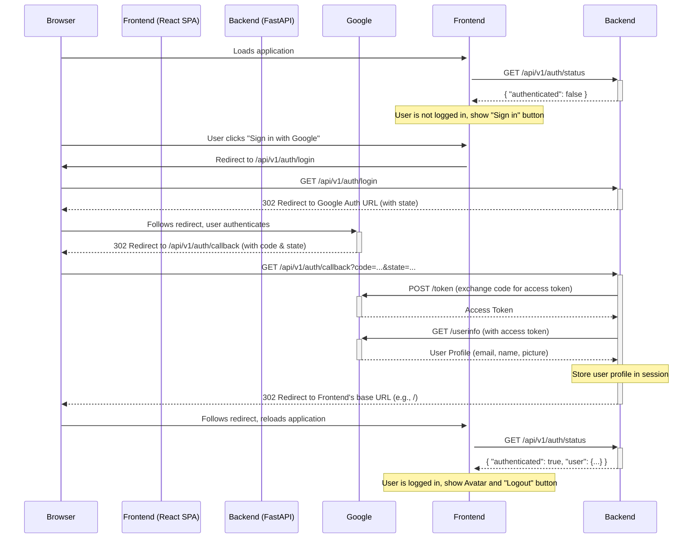

# Google OAuth2 Authentication Flow

This document describes the sequence of events for user authentication in FinanceHub via Google OAuth2.

## Sequence Diagram

## Flow Explanation

1.  **Initial Load**: The frontend application loads and immediately calls the `/api/v1/auth/status` endpoint to check if a valid session exists.
2.  **User Action**: The user clicks the "Sign in with Google" button. This is a simple link that directs the browser to the backend's `/api/v1/auth/login` endpoint.
3.  **Backend Redirect to Google**: The backend receives the request, generates a unique `state` token for CSRF protection (storing it in the session), and redirects the user's browser to the Google OAuth consent screen.
4.  **Google Authentication**: The user signs in with their Google account and authorizes the application.
5.  **Google Callback**: Google redirects the browser back to the `redirect_uri` specified in the configuration (`/api/v1/auth/callback`), including an authorization `code` and the original `state` token.
6.  **Token Exchange & Profile Fetch**: The backend's `/callback` endpoint receives the request.
    - It validates the `state` token against the one stored in the session.
    - It exchanges the `code` for an `access_token` by making a server-to-server request to Google's token endpoint.
    - It uses the `access_token` to fetch the user's profile information from Google's userinfo endpoint.
7.  **Session Creation**: The backend stores the relevant user information (name, email, picture) in the server-side session, which is identified by a secure, HTTP-only cookie sent to the browser.
8.  **Final Redirect**: The backend redirects the browser back to the root of the frontend application.
9.  **Authenticated State**: The frontend reloads, calls `/api/v1/auth/status` again, and this time receives the user's data, updating the UI to an authenticated state. 